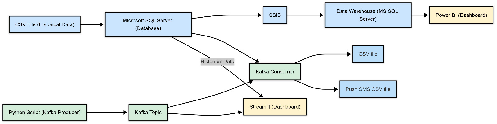

# 🧵 Skippy GFR - Global Fashion Retail Sales Analytics
This project implements a complete **Data Engineering** solution for a multinational fashion retailer, combining both **Batch** and **Streaming** architectures. The solution utilizes a synthetic dataset with over **4 million transactions**.

The architecture follows the **Lambda Architecture** to handle both batch and real-time data processing, offering a scalable and fault-tolerant system for processing large volumes of transactional data. The system is designed to handle data from multiple regions and currencies, providing valuable insights into sales trends, customer behavior, and marketing effectiveness.

## 📊 Dataset Summary

- 🏪 35 stores across 7 countries  
- 💱 Transactions in 4 currencies: USD, EUR, GBP, CNY  
- 🛍️ Product categories: Feminine, Masculine, Children  
- 👥 Includes customer and employee info  
- 📅 Covers 2 years of sales data  
- 🔐 Fully synthetic & privacy-safe with realistic complexity

## ⚙️ Architecture Overview

This project follows the **Lambda Architecture**, blending Batch and Real-time processing.

 

---

## 🧱 Batch Layer

- ✅ Cleaned large CSV files using **Apache Spark**
- ✅ Modeled and normalized data into **SQL Server** using **3NF**
- ✅ Transformed into a **Snowflake Schema** in a Data Warehouse using **SSIS**
- ✅ Created analytical dashboards to explore:
  - 📅 Sales by quarter/year
  - 🌍 Country & region performance
  - 🔁 Return behavior
  - 🎯 Discounts & pricing impact

> 📸 **Example Dashboard View:**

 

---

## ⚡ Streaming Layer

- 🌀 Simulated real-time transactions with a **Kafka Python Producer**
  - Kafka Topic: `skippy`
- 🧾 **Returns Consumer**: Saves last 15 return transactions into a file
- 📬 **Notifications Consumer**: Sends messages to customers post-purchase
- 📊 **Streamlit Dashboard**: Displays real-time sales & marketing campaign effects
- 🔄 All consumers enrich data by joining with the SQL Server DB (product/customer info)

---

## 🧰 Tools & Technologies

| Area             | Tools Used                            |
|------------------|----------------------------------------|
| Data Cleaning    | Apache Spark                           |
| Database         | SQL Server (3NF modeling)              |
| DWH              | SSIS + Snowflake Schema                |
| Batch Reporting  | Power BI or equivalent                 |
| Streaming        | Kafka (Python Producer/Consumer)       |
| Real-time Viz    | Streamlit                              |

---

## 📬 Contact

Made with 💻 by **Mohamed Roshdy**  
🔗 [LinkedIn Profile](https://www.linkedin.com/in/MohamedARoshdy)
You can watch the project walkthrough on YouTube: [Skippy GFR Project Walkthrough](https://youtu.be/7qnPgPZJUco)

---

## 🔮 Future Improvements (optional)

- Integrate Currency Exchange APIs for dynamic conversion
- Add ML for demand prediction
- Create automated testing for each pipeline stage

